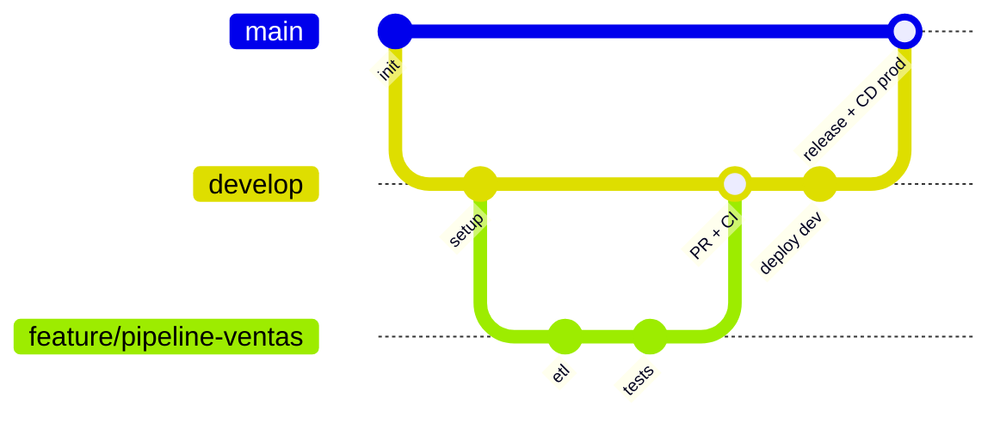
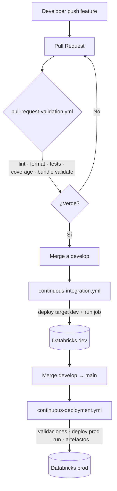
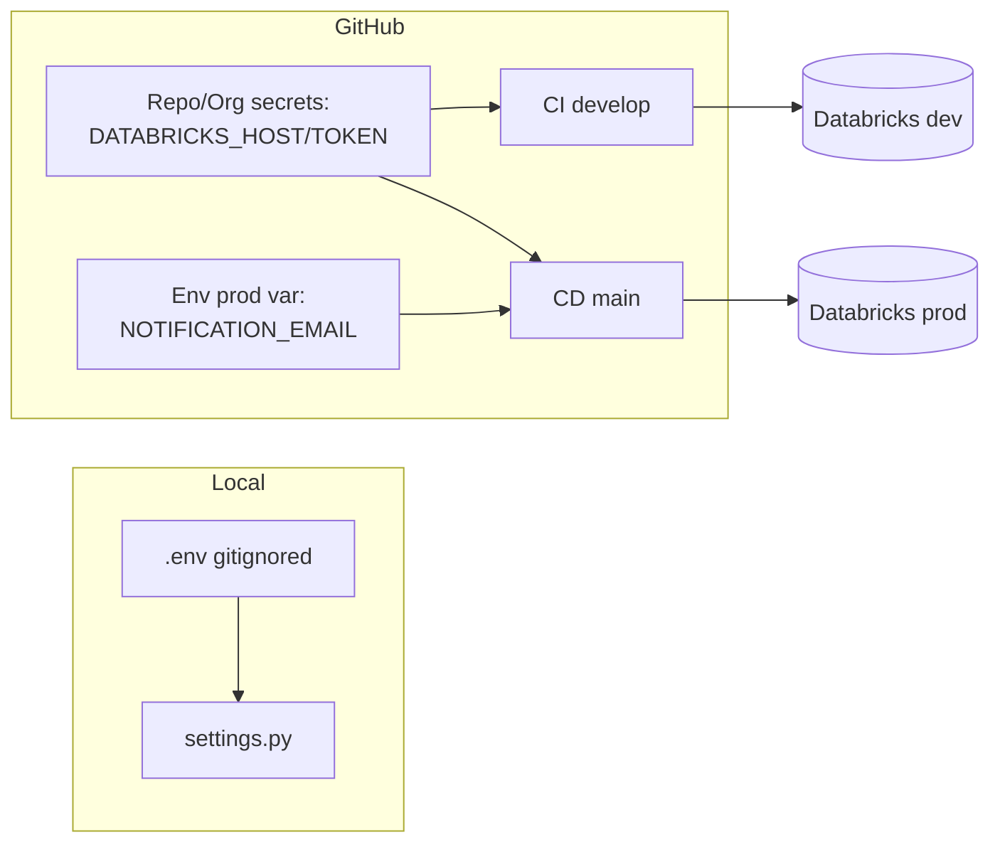
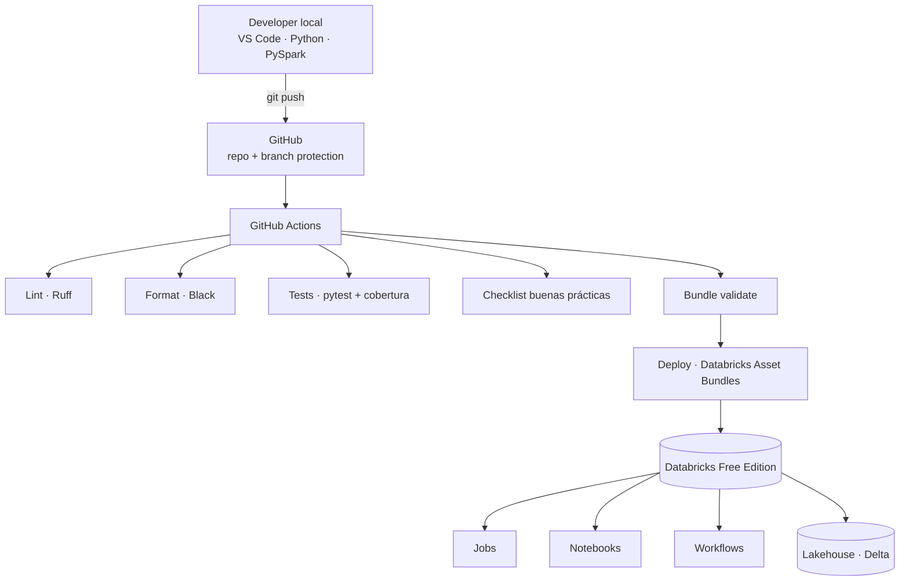

# Arquitectura del Laboratorio — `data-engineering-cicd-lab`

> Documento de arquitectura (rol: **Arquitecto de Soluciones**).
> Diseña la estructura, los flujos y las decisiones técnicas del laboratorio.
> No es código de producción: es el plano que ejecutan los demás roles
> (`data-engineer`, `devops`, `qa`, `documentation`, `security`).

---

## 1. Visión general y principios

El laboratorio demuestra un flujo **profesional** de Ingeniería de Datos: desde el
desarrollo local hasta el despliegue automatizado en **Databricks Free Edition**,
usando exclusivamente herramientas gratuitas.

### Principios de diseño

| Principio | Cómo se aplica |
|-----------|----------------|
| **Separación de responsabilidades** | Código de negocio, configuración, despliegue, automatización y documentación viven en carpetas distintas. |
| **Clean Architecture (donde aporta)** | La lógica de transformación (`common/`, `utilities/`) no depende de Spark session ni de rutas; se inyectan desde los `jobs/`. Así se puede testear sin cluster. |
| **Todo como código** | Pipelines, infraestructura de despliegue (Asset Bundles), calidad y entornos son ficheros versionados. |
| **Fail-fast y quality gates** | Ningún cambio llega a `main` sin pasar lint, formato, tests, cobertura y validación del bundle. |
| **Entornos reproducibles** | Versiones fijadas, `requirements` bloqueados, targets de bundle por entorno. |
| **Secretos fuera del repo** | Solo GitHub Secrets y variables de entorno; nunca credenciales en el árbol. |

### Regla de dependencias (Clean Architecture aplicada a datos)

```
notebooks / jobs   →  orquestan (I/O, Spark session, rutas)
        │
        ▼
   utilities        →  helpers de Spark (lectura/escritura, logging)
        │
        ▼
    common          →  lógica pura de negocio (transformaciones, reglas)
                        SIN dependencias de I/O  →  100% testeable con pytest
```

Las flechas apuntan **hacia adentro**: lo estable (reglas de negocio) no conoce lo
volátil (rutas, formato, plataforma). Esto es lo que hace los tests unitarios rápidos
y el código portable.

---

## 2. Estructura definitiva de carpetas y archivos

Se respeta la numeración solicitada (facilita seguir el laboratorio paso a paso) y se
concreta el contenido de cada directorio.

```
data-engineering-cicd-lab/
│
├── 01-project-documentation/
│   ├── README.md                     # Índice de la documentación
│   ├── ARQUITECTURA.md               # (este documento)
│   ├── guia-del-laboratorio.md       # Recorrido paso a paso por los 6 módulos
│   ├── flujo-cicd.md                 # Explicación del pipeline CI/CD
│   ├── diagrams/
│   │   ├── arquitectura.mmd           # Mermaid: arquitectura general
│   │   ├── flujo-cicd.mmd             # Mermaid: flujo CI/CD
│   │   └── git-flow.mmd               # Mermaid: estrategia de ramas
│   └── adr/                           # Architecture Decision Records
│       ├── 0001-estrategia-de-ramas.md
│       ├── 0002-databricks-asset-bundles.md
│       └── 0003-gestion-de-secretos.md
│
├── 02-development-environment/
│   ├── README.md                     # Cómo preparar el entorno local
│   ├── requirements.txt              # Dependencias de ejecución (runtime)
│   ├── requirements-dev.txt          # Dependencias de desarrollo (lint/test)
│   ├── .python-version               # Versión de Python fijada (pyenv)
│   ├── setup-python.md               # Instalación de Python
│   ├── setup-databricks-cli.md       # Instalación y `databricks configure`
│   ├── setup-git.md                  # Configuración de Git y del repo
│   └── vscode/
│       ├── settings.json             # Ajustes recomendados de VS Code
│       └── extensions.json           # Extensiones recomendadas
│
├── 03-data-pipeline/
│   └── src/
│       ├── jobs/                      # Puntos de entrada orquestables (main)
│       │   └── ventas_diarias.py
│       ├── notebooks/                # Notebooks Databricks (formato .py source)
│       │   └── exploracion_ventas.py
│       ├── utilities/                # Helpers de Spark (I/O, sesión) + piezas
│       │   │                         # que dependen de PySpark (ver §3)
│       │   ├── spark_session.py
│       │   ├── io.py
│       │   ├── esquemas.py           # Esquema explícito de Spark (StructType)
│       │   └── transformaciones_spark.py  # Reglas de negocio en expr. Spark
│       └── common/                   # Lógica pura de negocio (testeable)
│           ├── transformaciones.py
│           └── validaciones.py
│
├── 04-unit-tests/
│   ├── unit/                         # Tests de lógica pura (common/) y afines
│   │   ├── test_transformaciones.py
│   │   ├── test_validaciones.py
│   │   ├── test_calidad_datos_muestra.py
│   │   └── test_job_ventas.py
│   ├── integration/                  # Tests end-to-end con Spark local
│   │   └── test_pipeline_ventas.py
│   ├── fixtures/                     # Datos y objetos de prueba deterministas
│   │   └── ventas_muestra.py
│   └── conftest.py                   # SparkSession de test compartida
│
├── 05-code-quality/
│   ├── README.md                     # Estándares de calidad del proyecto
│   ├── ruff.toml                     # Reglas de linting
│   ├── checklist-buenas-practicas.md # Criterios revisados por el gate
│   └── reports/                      # Salida de cobertura (gitignored)
│       └── .gitkeep
│
├── 06-databricks-deployment/
│   ├── resources/
│   │   ├── ventas_job.yml            # Definición del Job (incluido desde databricks.yml raíz)
│   │   └── ventas_pipeline.yml       # (opcional) Delta Live Tables
│   └── README.md                     # Cómo validar/desplegar el bundle
│
├── 07-github-actions/
│   └── (ver nota)                    # Los workflows viven en .github/workflows/
│
├── 08-sample-data/
│   ├── csv/ventas.csv
│   ├── json/
│   ├── parquet/
│   └── delta/                        # Se genera en ejecución (gitignored)
│
├── 09-configuration/
│   ├── settings.py                   # Configuración central (lee env vars)
│   ├── constants.py                  # Constantes del dominio
│   ├── .env.example                  # Plantilla de variables (SIN valores reales)
│   └── profiles/
│       ├── dev.yml
│       └── prod.yml
│
├── 10-automation-scripts/
│   ├── setup.sh / setup.ps1          # Prepara el entorno local
│   ├── run-tests.sh / run-tests.ps1  # Lint + format + pytest + cobertura
│   ├── deploy.sh / deploy.ps1        # databricks bundle deploy
│   ├── run-local.sh / run-local.ps1  # Ejecuta el pipeline con Spark local
│   └── clean.sh / clean.ps1          # Limpia caches y artefactos
│
├── 11-project-resources/
│   ├── images/
│   ├── logos/
│   ├── diagrams/                     # PNG exportados para el README
│   ├── presentations/
│   └── examples/
│
├── .github/
│   └── workflows/
│       ├── pull-request-validation.yml
│       ├── continuous-integration.yml
│       └── continuous-deployment.yml
│
├── databricks.yml                    # Definición raíz del Asset Bundle (ver ADR 0002:
│                                      # vive en la raíz, NO en 06-databricks-deployment/,
│                                      # para que el sync incluya 03-data-pipeline/)
├── pyproject.toml                    # Metadatos, config de black/ruff/pytest/coverage
├── .gitignore
└── README.md                         # Portada del proyecto (portafolio)
```

> **Nota sobre `07-github-actions/`**: GitHub **exige** que los workflows estén en
> `.github/workflows/` para ejecutarse. Por eso los YAML "vivos" están ahí, y
> `07-github-actions/` contiene su **documentación y explicación** (o enlaces
> simbólicos/copias didácticas). Esto se registra en un ADR para que la decisión
> quede explícita y no parezca una inconsistencia.

---

## 3. Justificación de cada directorio

| Carpeta | Por qué existe | Responsable |
|---------|----------------|-------------|
| `01-project-documentation` | Un portafolio se juzga por su claridad. Centraliza arquitectura, guía, diagramas y ADRs. | `documentation`, `architect` |
| `02-development-environment` | Reproducibilidad: cualquiera clona y en minutos tiene el entorno idéntico. | `devops` |
| `03-data-pipeline` | El código de negocio, separado en capas (jobs → utilities → common) para testeo y portabilidad. `utilities/` aloja tanto los helpers de Spark (sesión, lectura/escritura en `spark_session.py`/`io.py`) como el **esquema explícito** (`esquemas.py`) y la **reimplementación en expresiones de Spark** de las reglas de negocio (`transformaciones_spark.py`) — ambos importan `pyspark.sql`, por lo que no pueden vivir en `common`, que debe permanecer 100 % Spark-free para ser testeable sin cluster/JVM. `transformaciones_spark.py` comparte umbrales y categorías con `common.transformaciones` (fuente única de verdad) y las pruebas de integración verifican que ambas implementaciones coinciden. | `data-engineer` |
| `04-unit-tests` | Calidad verificable. Separa unit (rápidos) de integration (Spark real). | `qa` |
| `05-code-quality` | Estándares como código: reglas de lint, checklist y reportes. | `qa`, `code-reviewer` |
| `06-databricks-deployment` | Despliegue como código con Asset Bundles: mismo artefacto a cualquier entorno. | `devops` |
| `07-github-actions` | Documenta el CI/CD; los YAML ejecutables van en `.github/workflows/`. | `devops` |
| `08-sample-data` | Datos deterministas para demostrar el pipeline sin depender de fuentes externas. | `data-engineer` |
| `09-configuration` | Configuración centralizada y por entorno, leyendo de variables (nunca secretos en el repo). | `devops`, `security` |
| `10-automation-scripts` | "Un comando para cada cosa": reduce fricción y errores manuales. Scripts `.sh` y `.ps1` (Windows). | `devops` |
| `11-project-resources` | Material visual para presentación y portafolio. | `documentation` |

---

## 4. Estrategia de ramas

**Decisión: Git Flow simplificado** (adecuado para un laboratorio con entornos
`develop` y `main` bien diferenciados). Se documenta en `adr/0001`.



| Rama | Propósito | Disparador CI/CD |
|------|-----------|------------------|
| `feature/*` | Trabajo en curso | Al abrir **PR** → validación (lint, format, tests, bundle validate). |
| `develop` | Integración / entorno de desarrollo | Al hacer **merge** → deploy automático a target `dev` + ejecuta el Job. |
| `main` | Producción / release estable | Al hacer **merge** → validaciones finales, deploy a `prod`, ejecuta pipeline y publica artefactos. |

**Reglas de protección de rama** (branch protection):
- `main` y `develop`: requieren PR + checks en verde + al menos 1 review.
- Prohibido push directo a `main`.

> **Alternativa considerada — Trunk Based Development**: excelente para equipos con
> despliegue continuo maduro y feature flags. Se descarta para el laboratorio porque
> Git Flow con `develop`/`main` **enseña mejor** la separación dev→prod y mapea 1:1
> con los dos targets del bundle. El roadmap contempla migrar a TBD en un nivel avanzado.

---

## 5. Diseño de los workflows de GitHub Actions

Tres workflows, cada uno con una responsabilidad única.

### 5.1 `pull-request-validation.yml` — Quality gate

**Disparador**: `pull_request` hacia `develop` o `main`.
**Objetivo**: nada roto entra. No despliega.

```
checkout → setup-python (matriz 3.11/3.12) → cache pip →
install deps → ruff check → black --check → pytest + cobertura →
checklist buenas prácticas → databricks bundle validate
```

- Falla si: lint falla, formato incorrecto, algún test falla, cobertura < umbral
  (p. ej. 90 % en `common/`), el bundle no valida, o el checklist detecta problemas.
- `permissions: contents: read` (mínimo privilegio). Sin secretos de despliegue aquí.

### 5.2 `continuous-integration.yml` + CD a `develop`

**Disparador**: `push` a `develop` (resultado de un merge).
**Objetivo**: desplegar al entorno de desarrollo y ejecutar el Job.

```
[reusa validación] → databricks bundle validate (target dev) →
databricks bundle deploy --target dev →
databricks bundle run ventas_job --target dev →
publicar logs del run como artefacto
```

- Usa `DATABRICKS_HOST` y `DATABRICKS_TOKEN` (GitHub Secrets del *environment* `dev`).

### 5.3 `continuous-deployment.yml` — Release a `main`

**Disparador**: `push` a `main`.
**Objetivo**: release a producción con control.

```
validaciones finales → bundle validate (target prod) →
bundle deploy --target prod → bundle run (pipeline) →
publicar artefactos (reporte de cobertura, logs, versión)
```

- Usa el *environment* `prod` de GitHub (puede exigir **required reviewers** para un
  gate manual antes del deploy real).

### Patrón transversal

- **Reutilización**: la validación es un workflow reutilizable (`workflow_call`) que
  CI y CD invocan, evitando duplicar pasos.
- **`concurrency`**: cancela runs obsoletos por rama.
- **Versiones fijadas** de `actions/*` (seguridad).
- **Cache de pip** para acelerar.



---

## 6. Organización de Databricks Asset Bundles

Un único bundle con **targets por entorno**. Esto garantiza que el mismo artefacto se
despliega a `dev` y `prod` cambiando solo configuración.

`databricks.yml` (en la **raíz del repo**, no dentro de `06-databricks-deployment/` —
ver `adr/0002-databricks-asset-bundles.md`):

```yaml
bundle:
  name: data-engineering-cicd-lab

include:
  - 06-databricks-deployment/resources/*.yml

variables:
  catalogo:
    description: Catálogo Unity destino
    default: dev
  notification_email:
    description: >-
      Email para notificaciones del job. Vacío por defecto; el target "prod"
      lo recibe en tiempo de deploy vía BUNDLE_VAR_notification_email
      (inyectada por continuous-deployment.yml desde la variable de Environment
      "prod" NOTIFICATION_EMAIL de GitHub).
    default: ""
  ruta_datos:
    description: >-
      Ruta al CSV de ventas (parámetro --ruta-csv del spark_python_task). En
      dev usa el dataset de muestra del repo; en prod apunta al volumen de
      Unity Catalog (alineado con 09-configuration/profiles/prod.yml).
    default: 08-sample-data/csv/ventas.csv

targets:
  dev:
    mode: development          # prefija recursos con el usuario, pausa schedules
    default: true
    variables:
      catalogo: dev
      ruta_datos: 08-sample-data/csv/ventas.csv
  prod:
    mode: production           # nombres limpios, validaciones estrictas
    variables:
      catalogo: prod
      ruta_datos: /Volumes/prod/ventas/entrada/ventas.csv
      # notification_email NO se fija aquí: se inyecta desde CD (ver arriba).
```

`06-databricks-deployment/resources/ventas_job.yml` (el Job como código, incluido
desde el `databricks.yml` de la raíz):

```yaml
resources:
  jobs:
    ventas_job:
      name: "[${bundle.target}] Ventas Diarias"
      tasks:
        - task_key: procesar_ventas
          spark_python_task:
            # Ruta relativa a la raíz del bundle (raíz del repo): SIN "../".
            python_file: 03-data-pipeline/src/jobs/ventas_diarias.py
            parameters: ["--ruta-csv", "${var.ruta_datos}"]
      # En Free Edition se usa cómputo serverless (sin definir clusters propios)
      email_notifications:
        on_failure:
          - ${var.notification_email}
```

**Decisiones clave**:
- `mode: development` vs `production` da comportamiento seguro por entorno sin duplicar
  ficheros.
- La variable se llama `catalogo` (no `catalog`); `ruta_datos` parametriza el
  CSV/volumen de entrada por entorno y se pasa al job como `--ruta-csv ${var.ruta_datos}`.
- El Job apunta al código en `03-data-pipeline` → **una sola fuente de verdad**.
- `databricks.yml` vive en la raíz del repo para que el `sync` del bundle incluya
  tanto el código (`03-data-pipeline/`) como los recursos (`06-databricks-deployment/resources/`).

> ⚠️ **Caveat técnico honesto (Databricks Free Edition)**: la disponibilidad de
> **tokens de API / cómputo para despliegue automatizado** varía según la edición. La
> *Free Edition* (2025) ofrece cómputo **serverless**, por lo que los Jobs no definen
> clusters. Si el despliegue por token desde GitHub Actions estuviera limitado en tu
> cuenta, el plan B documentado es: (a) `databricks bundle validate` corre igual en CI
> (no requiere workspace), y (b) el `deploy`/`run` se ejecuta con el script
> `10-automation-scripts/deploy.*` autenticado con **OAuth U2M** localmente. Esto se
> registra en `adr/0002` y se valida en el primer sprint antes de cablear el CD real.

---

## 7. Gestión de secretos y configuración por entorno

**Regla de oro**: cero secretos en el repositorio (lo audita el rol `security` y el
checklist automático).

| Nivel | Qué guarda | Dónde |
|-------|------------|-------|
| **Local (dev)** | `DATABRICKS_HOST`, `DATABRICKS_TOKEN`/OAuth | `.env` local (gitignored) + `databricks configure`. `.env.example` como plantilla. |
| **CI/CD** | `DATABRICKS_HOST`, `DATABRICKS_TOKEN` | **Secretos de repositorio u organización** (NO de Environment — ver nota). |
| **CI/CD** | `NOTIFICATION_EMAIL` (no sensible) | **Variable del Environment `prod`**; se inyecta como `BUNDLE_VAR_notification_email`. |
| **Config no sensible** | catálogos, rutas, flags | `09-configuration/settings.py`, leído de variables de entorno. Los `profiles/*.yml` son plantillas de referencia (no se cargan en runtime). |

- `settings.py` **lee** de variables de entorno con valores por defecto seguros; nunca
  contiene credenciales.
- `permissions:` mínimo en cada workflow; los secretos de deploy solo se exponen en los
  jobs de CD/despliegue, nunca en la validación de un PR directo.
- **Modelo de secretos (importante):** los jobs `validate` de CI/CD invocan el workflow
  reutilizable con `uses:`, y un job `uses:` **no admite `environment:`**. Por eso
  `DATABRICKS_HOST`/`DATABRICKS_TOKEN` deben ser secretos de **repositorio/organización**
  y se reenvían explícitamente por `workflow_call`. **No los dupliques como Environment
  secrets** con el mismo nombre (los jobs con `environment:` los resolverían solos y
  podrían divergir). El Environment `prod` sí aporta el gate de **required reviewers**.
  Detalle en [`adr/0003-gestion-de-secretos.md`](adr/0003-gestion-de-secretos.md).



---

## 8. Herramientas de calidad y pruebas

| Herramienta | Rol | Configuración |
|-------------|-----|---------------|
| **Ruff** | Linter (errores, imports, bugs, modernización) | `ruff.toml` / `pyproject.toml` |
| **Black** | Formateo determinista | `pyproject.toml` (line-length coherente con Ruff) |
| **pytest** | Unit + integración | `pyproject.toml` (`pythonpath`, `testpaths`) |
| **pytest-cov / coverage** | Cobertura con umbral que falla el build | `--cov-fail-under=90` en `common/` |
| **Checklist automático** | Buenas prácticas del proyecto (ver §9) | Script en `10-automation-scripts` + step en el workflow |

- **Ruff + Black** son complementarios: Ruff no reformatea todo lo que Black hace; se
  configuran con la misma longitud de línea para no pelear.
- Los tests **unitarios** corren sin Spark (lógica de `common/`) → milisegundos.
- Los tests de **integración** usan una `SparkSession` local (`conftest.py`) → validan
  el pipeline real con `08-sample-data`.

---

## 9. Checklist automático de buenas prácticas

Se implementa como un step del workflow (script Python en `10-automation-scripts`) que
revisa y **falla el PR** si no se cumple:

| Chequeo | Cómo se valida |
|---------|----------------|
| Nombres descriptivos | Ruff (`N` pep8-naming) + revisión del `code-reviewer`. |
| Documentación | Presencia de docstrings en módulos/funciones públicas (Ruff `D` opcional). |
| Tipado | Anotaciones de tipos presentes; opcional `mypy` en nivel avanzado. |
| Imports ordenados | Ruff `I` (isort). |
| Sin duplicidad evidente | Ruff + umbral simple de similitud / revisión. |
| Secretos fuera del repo | Escaneo de patrones (tokens, claves) + `.env` en `.gitignore`. |
| Uso correcto de variables | Ruff `F` (variables sin usar, redefiniciones). |
| Estructura del proyecto | Script verifica que existan las carpetas `01`–`11` esperadas. |
| Pruebas existentes | Falla si un módulo de `common/` no tiene test asociado. |
| Convenciones de nombres | Ruff `N` + reglas del `ruff.toml`. |

---

## 10. Diagrama de arquitectura general



---

## 11. Roadmap de evolución (de básico a nivel empresa)

### Nivel 0 — Fundamentos (MVP del laboratorio) ✅ objetivo inicial
- Estructura `01`–`11`, un pipeline `ventas_diarias` con capa `common` testeable.
- CI: lint + format + pytest + cobertura + bundle validate en cada PR.
- CD: deploy a `dev` en merge a `develop`; deploy a `prod` en merge a `main`.
- Documentación y diagramas por módulo.

### Nivel 1 — Robustez
- Cobertura ≥ 90 % y tests de integración con Spark local.
- Checklist de buenas prácticas automatizado y bloqueante.
- ADRs para cada decisión mayor.
- Secrets por *environment* con reviewer manual en `prod`.

### Nivel 2 — Calidad de datos
- Expectativas de datos (esquema, nulos, unicidad, rangos) como tests.
- Delta Live Tables / *expectations* nativas de Databricks.
- Reportes de cobertura y calidad publicados como artefactos y en el README.

### Nivel 3 — Escalabilidad y multi-entorno
- Target `staging` además de `dev`/`prod`.
- Parametrización por catálogo Unity, `mode: production` estricto.
- Versionado semántico y *release notes* automáticas.

### Nivel 4 — Prácticas de empresa
- Migración a Trunk Based Development + feature flags.
- Escaneo de seguridad (dependabot, secret scanning, SAST).
- Observabilidad: métricas del pipeline, alertas, linaje de datos.
- Pre-commit hooks, entornos efímeros por PR, gate de aprobación multi-rol.

---

## 12. Siguientes pasos accionables (delegación)

| Paso | Entrega | Subagente |
|------|---------|-----------|
| 1 | Crear el esqueleto de carpetas `01`–`11` + `.gitignore` + `pyproject.toml` | `devops` |
| 2 | Implementar `common/` + `jobs/ventas_diarias` + datos de muestra | `data-engineer` |
| 3 | Tests unit + integración + `conftest.py` | `qa` |
| 4 | Config de Ruff/Black/pytest/cobertura y checklist automático | `qa` / `code-reviewer` |
| 5 | `databricks.yml` + `resources/ventas_job.yml` | `devops` |
| 6 | Los 3 workflows de GitHub Actions | `devops` |
| 7 | Auditoría de secretos y permisos de los workflows | `security` |
| 8 | README de portada + guía del laboratorio + diagramas exportados | `documentation` |
| 9 | Validar el caveat de Free Edition (deploy por token vs OAuth local) | `devops` + `architect` |

> **Criterio de éxito global**: un `git push` de una feature abre un PR que se valida
> solo; al mergear a `develop` el pipeline se despliega y ejecuta en Databricks; al
> mergear a `main` se publica un release — todo reproducible y documentado.
