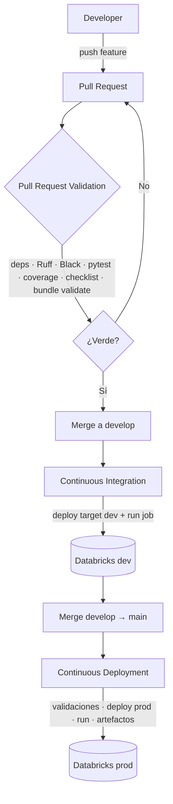

# Flujo CI/CD

## Visión general

## Disparadores

| Evento | Workflow | Acciones |
|--------|----------|----------|
| PR → `develop`/`main` | `pull-request-validation.yml` | Lint, format, tests, cobertura, checklist, bundle validate. |
| push → `develop` | `continuous-integration.yml` | Revalida, deploy `dev`, ejecuta job. |
| push → `main` | `continuous-deployment.yml` | Validaciones finales, deploy `prod`, ejecuta pipeline, publica artefactos. |

## Quality gates (bloquean el merge)

1. **Ruff** — linting (errores, imports, naming, bugs).
2. **Black** — formato determinista.
3. **pytest + coverage** — pruebas y cobertura ≥ 90 % en `common/`.
4. **Checklist** — 10 criterios de buenas prácticas.
5. **Bundle validate** — el Asset Bundle es válido.

## Gestión de secretos

Los secretos (`DATABRICKS_HOST`, `DATABRICKS_TOKEN`) se guardan como *Environment
secrets* en GitHub (`dev` y `prod`), nunca en el repositorio. El entorno `prod`
puede requerir *required reviewers* como aprobación manual.
